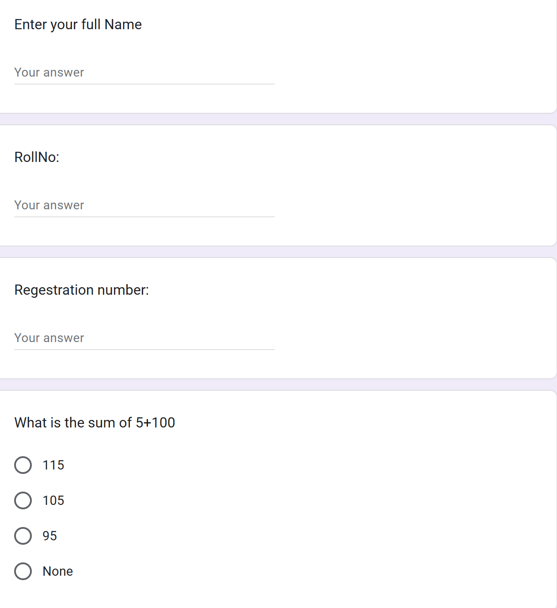
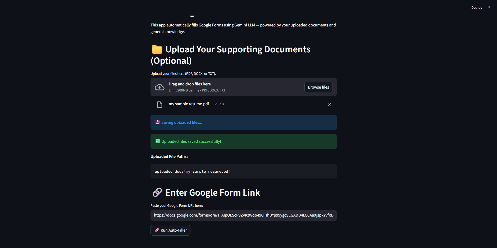
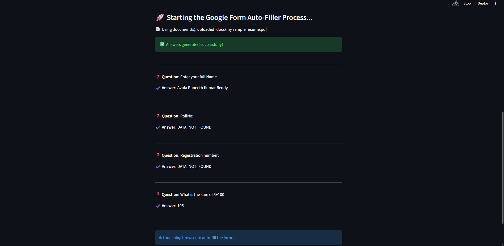
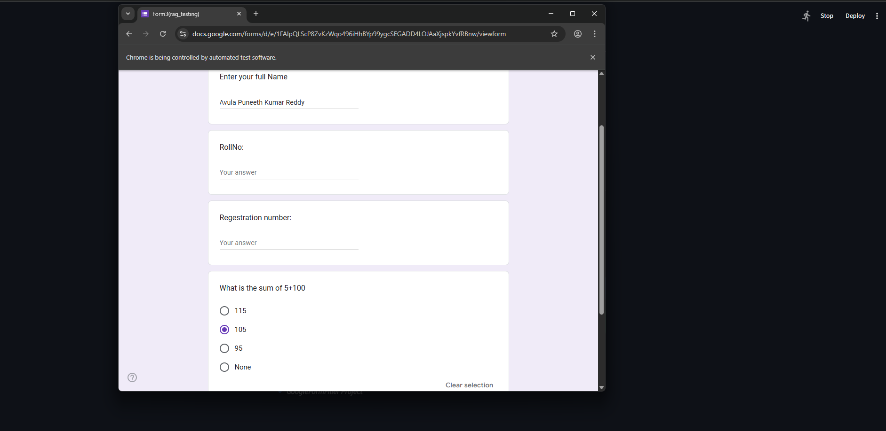

# 🧠 AI‑Powered Google Form Auto‑Filler


An intelligent automation system that **reads your documents, understands context using RAG, and automatically fills Google Forms** using **Google Gemini + Selenium**.

This tool eliminates repetitive form‑filling — perfect for **job applications, college forms, surveys, and registrations**.

---

## 🚀 What This Project Does

1. 📄 Reads resumes / documents (PDF, DOCX, TXT)
2. 🧠 Retrieves relevant context using **FAISS + LangChain**
3. 🤖 Generates accurate answers using **Gemini 2.5 Flash**
4. 🕷️ Scrapes Google Form questions
5. 🖱️ Automatically fills the form in a real browser

---

## 📸 Demo (Actual Screenshots)

### 1️⃣ Streamlit Web Interface
<p align="center">
  
</p>

---

### 2️⃣ Sample Google Form
<p align="center">
  
</p>

---

### 3️⃣ Uploading Resume & Form URL
<p align="center">
  
</p>

---

### 4️⃣ AI‑Generated Answers (RAG Output)
<p align="center">
  
</p>

---

### 5️⃣ Selenium Auto‑Filling the Form
<p align="center">
  
</p>

---

## ✨ Key Features

- 📄 **Document‑Aware AI** (RAG‑based)
- 🤖 **Gemini 2.5 Flash** powered answers
- 🧠 **Context‑safe answering** (returns `DATA_NOT_FOUND` if info missing)
- 🕷️ **Google Form Scraping**
- 🖱️ **Selenium Browser Automation**
- 🖥️ **Streamlit UI + CLI Support**
- ☁️ **Cross‑Platform (Windows / Linux / Render)**

---

## 🛠️ Tech Stack

| Component | Technology |
|---------|-----------|
| LLM | Google Gemini 2.5 Flash |
| RAG | LangChain + FAISS |
| Embeddings | HuggingFace `instructor-base` |
| Automation | Selenium + WebDriver Manager |
| Frontend | Streamlit |
| Language | Python 3.10+ |

---

## 🚀 Installation & Setup

### 1️⃣ Clone Repository
```bash
git clone https://github.com/avulapuneethkumarreddy/GForm_Filler.git
cd GForm_Filler
```

### 2️⃣ Create Virtual Environment
```bash
python -m venv venv
# Windows
venv\Scripts\activate
# Mac / Linux
source venv/bin/activate
```

### 3️⃣ Install Dependencies
```bash
pip install -r requirements.txt
```

### 4️⃣ Set Environment Variable
Create `.env` file:
```env
GFF_key=YOUR_GEMINI_API_KEY
```

Get your key from **Google AI Studio**.

---

## 💻 Usage

### ✅ Option A: Streamlit Web App (Recommended)
```bash
streamlit run app.py
```

Steps:
1. Upload resume / documents
2. Paste Google Form URL
3. Click **Run Auto‑Filler**
4. Watch the browser fill the form

---

### 🧪 Option B: CLI Mode
```bash
python main.py
```

Edit document paths inside `main.py` if needed.

---

## 📂 Project Structure

```
GForm_Filler/
│
├── app.py                 # Streamlit Web UI
├── main.py                # CLI Runner
├── answer_retrever.py     # RAG + Gemini Brain
├── question_retrever.py  # Google Form Scraper
├── form_filler.py        # Selenium Automation
├── requirements.txt
├── screenshots/           # Demo images
└── README.md
```

---

## ⚠️ Requirements & Limitations

* **Google Chrome:** Required (Chrome WebDriver is used)
* **Supported Question Types:** Short Answers, Paragraphs, MCQs, Checkboxes, Dropdowns
* **Complex Forms:** Multi‑page or logic‑heavy forms may need review
* **Login Required Forms:** Google Sign‑In forms are not supported

---

## 🤝 Contributing

Contributions are welcome!

1. Fork the project  
2. Create your feature branch (`git checkout -b feature/AmazingFeature`)  
3. Commit changes (`git commit -m 'Add AmazingFeature'`)  
4. Push (`git push origin feature/AmazingFeature`)  
5. Open a Pull Request  

---

### 💡 Developed by **Avula Puneeth Kumar Reddy**
